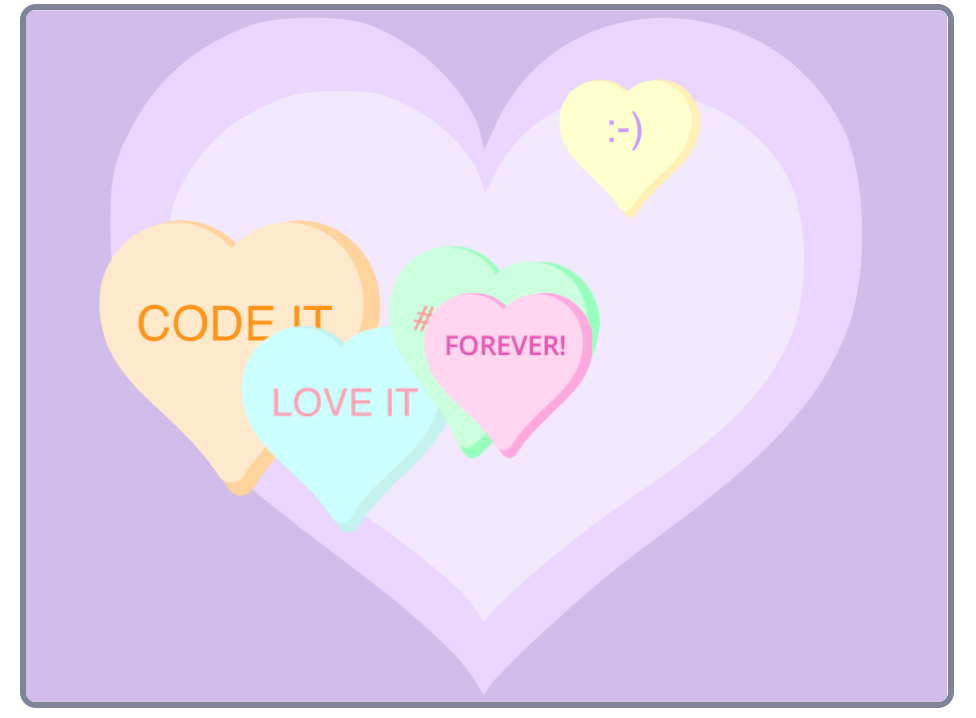

## Introduction
You're going to create a project with sprites that move over a backdrop to try and change someone's mood. You can choose to make your project relaxing, energising, funny, inspiring or something else, it's your choice. You will choose a theme for your project a select a backdrop and sprites. You will invent an algorithm for each of the sprites.

## Skills you should have
To do complete project you need to have the following skills which you may have learnt completing Butterfly garden.
- How to use costumes
- How to use the `forever`{:class="block3control"} block

You will now apply these skills to create your own project.

## What others have made

Go to the [Looping sprites](https://scratch.mit.edu/studios/27014672){:target="_blank"} studio where you can investigate projects created by others to get ideas for your project. 

Tip: 'See inside' a project to see the code. 

--- no-print ---
Click the green flag and watch the sprites move around:

  <iframe allowtransparency="true" width="485" height="402" src="https://scratch.mit.edu/projects/embed/407384474/?autostart=false" frameborder="0"></iframe>

--- /no-print ---

--- print-only ---

--- /print-only ---

--- collapse ---
---
title: What you will need
---
### Hardware

+ Describe hardware here

### Software

+ Scratch 3.0 (either [online](http://rpf.io/scratchon) or [offline](http://rpf.io/scratchoff))

### Downloads

+ [rpf.io/project-name-go](http://rpf.io/project-name-go){:target="_blank"}

--- /collapse ---

--- collapse ---
---
title: What you will learn
---

+ Two or three learning objectives
+ ...should go here

--- /collapse ---

--- collapse ---
---
title: Additional information for educators
---

If you need to print this project, please use the [printer-friendly version](https://projects.raspberrypi.org/en/projects/project-name/print){:target="_blank"}.

[Here is a link to the resources for this project](http://rpf.io/project-name-go).

--- /collapse ---
